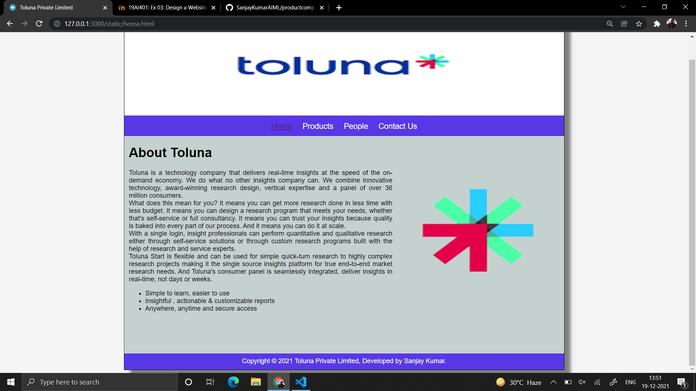
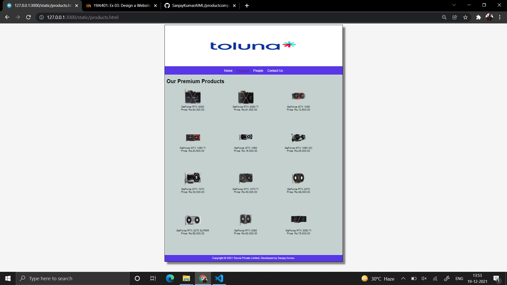
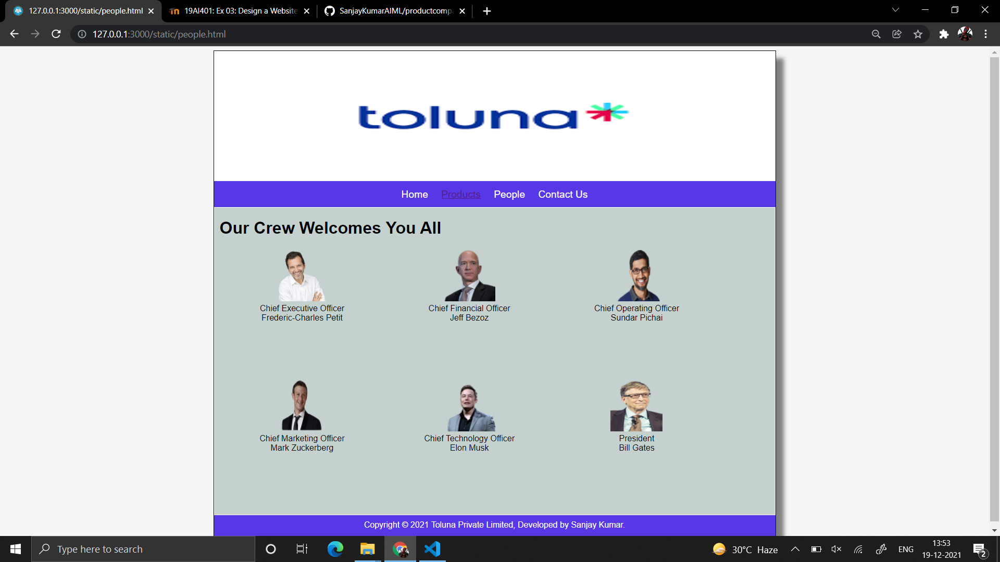
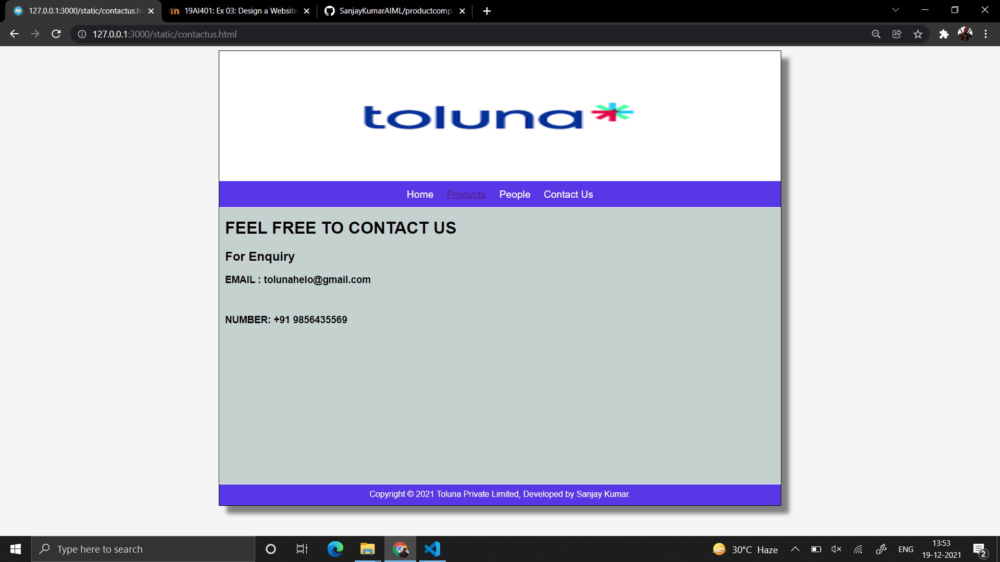

# Web Design for a Software Product Company

## AIM:

To design a static website for a software product company company.

## DESIGN STEPS:

### Step 1:

Requirement collection.

### Step 2:

Creating the layout using HTML and CSS.

### Step 3:

Updating the sample content.

### Step 4:

Choose the appropriate style and color scheme.

### Step 5:

Validate the layout in various browsers.

### Step 6:

Validate the HTML code.

### Step 6:

Publish the website in the given URL.

## PROGRAM :
### Home Page:
```
<!DOCTYPE html>
<html lang="en">
  <head>
    <title>Toluna Private Limited</title>
    <link rel="stylesheet" href="./css/layout.css" />
    <link rel="icon" href="./img/icon.png" type="image/x-icon" />
  </head>

  <body>
    <div class="container">
      <div class="banner"></div>
      <div class="menu">
        <div class="menuitemselected"><a href="/static/home.html">Home</a></div>
        <div class="menuitem"><a href="products.html">Products</a></div>
        <div class="menuitem"><a href='people.html'a>People</a></div>
        <div class="menuitem"><a href='contactus.html'>Contact Us</a></div>
      </div>
      <div class="content">
        <div class="homecontent">
          <h1>About Toluna</h1>
          
          <div class="contenttext">
            Toluna is a technology company that delivers real-time insights at the speed of the on-demand economy.
            We do what no other insights company can. We combine innovative technology, award-winning research design,
            vertical expertise and a panel of over 36 million consumers.
            <br/>
            What does this mean for you? It means you can get more research done in less time with less budget.
            It means you can design a research program that meets your needs, whether that's self-service or full consultancy.
            It means you can trust your insights because quality is baked into every part of our process. 
            And it means you can do it at scale.
            <br />
            With a single login, insight professionals can perform quantitative and qualitative research either through 
            self-service solutions or through custom research programs built with the help of research and service experts.
            <br/>
            Toluna Start is flexible and can be used for simple quick-turn research to highly complex research projects making 
            it the single source insights platform for true end-to-end market research needs. And Toluna's consumer panel is 
            seamlessly integrated, deliver insights in real-time, not days or weeks.
            <ul>
              <li>Simple to learn, easier to use</li>
              <li>Insightful , actionable & customizable reports</li>
              <li>Anywhere, anytime and secure access</li>
            </ul>
          </div>
        </div>
      </div>
      <div class="footer">
        Copyright &#169; 2021 Toluna Private Limited, Developed by Sanjay Kumar.
      </div>
    </div>
  </body>
</html>

```
### Product Page:
```
<!DOCTYPE html>
<html lang="en">
  <head>
    <title></title>
    <link rel="stylesheet" href="./css/layout.css" />
    <link rel="icon" href="./img/icon.png" type="image/x-icon" />
  </head>

  <body>
    <div class="container">
      <div class="banner"></div>
      <div class="menu">
        <div class="menuitem"><a href="/static/home.html">Home</a></div>
        <div class="menuitemselected">
          <a href="/static/products.html">Products</a>
        </div>
        <div class="menuitem"><a href='/static/people.html'>People</a></div>
        <div class="menuitem"><a href='./contactus.html'>Contact Us</a></div>
      </div>
      <div class="content">
        <div class="productcontent">    
          <h1>Our Premium Products</h1>
          <div class="productitems">
              <div class="productitem"> 
                  <div class="itemimage">
                  
                  </div>
                  <div class="itemname">GeForce RTX 3080</div>
                  <div class="itemprice">Price: Rs.80,300.00 </div>
              </div>
              <div class="productitem"> 
                  <div class="itemimage">
                  
                  </div>
                  <div class="itemname">GeForce RTX 3080 TI</div>
                  <div class="itemprice">Price: Rs.91,500.00 </div>
              </div>
              <div class="productitem"> 
                <div class="itemimage">
                
                </div>
                <div class="itemname">GeForce GTX 1050</div>
                <div class="itemprice">Price: Rs.12,500.00 </div>
            </div>
            <div class="productitem"> 
              <div class="itemimage">
              
              </div>
              <div class="itemname">GeForce GTX 1050 TI</div>
              <div class="itemprice">Price: Rs.20,500.00 </div>
           </div>
           <div class="productitem"> 
            <div class="itemimage">
            
            </div>
            <div class="itemname">GeForce GTX 1060</div>
            <div class="itemprice">Price: Rs.15,000.00 </div>
           </div>
           <div class="productitem"> 
            <div class="itemimage">
            
            </div>
            <div class="itemname">GeForce GTX 1060 OC</div>
            <div class="itemprice">Price: Rs.25,000.00 </div>
           </div>
           <div class="productitem"> 
            <div class="itemimage">
            
            </div>
            <div class="itemname">GeForce GTX 1070 </div>
            <div class="itemprice">Price: Rs.30,000.00 </div>
           </div>
           <div class="productitem"> 
            <div class="itemimage">
            
            </div>
            <div class="itemname">GeForce GTX 1070 TI</div>
            <div class="itemprice">Price: Rs.40,000.00 </div>
           </div>
           <div class="productitem"> 
            <div class="itemimage">
            
            </div>
            <div class="itemname">GeForce RTX 2070 </div>
            <div class="itemprice">Price: Rs.49,000.00 </div>
           </div>
           <div class="productitem"> 
            <div class="itemimage">
            
            </div>
            <div class="itemname">GeForce RTX 2070 SUPER </div>
            <div class="itemprice">Price: Rs.58,000.00 </div>
           </div>
           <div class="productitem"> 
            <div class="itemimage">
            
            </div>
            <div class="itemname">GeForce RTX 3060 </div>
            <div class="itemprice">Price: Rs.63,000.00 </div>
           </div>
           <div class="productitem"> 
            <div class="itemimage">
            
            </div>
            <div class="itemname">GeForce RTX 3060 TI</div>
            <div class="itemprice">Price: Rs.75,000.00 </div>
           </div>
          </div>
          </div>        
      </div>
      <div class="footer">
        Copyright &#169; 2021 Toluna Private Limited, Developed by Sanjay Kumar.
      </div>
    </div>
  </body>
</html>

```
### People Page:
```
<!DOCTYPE html>
<html lang="en">
  <head>
    <title></title>
    <link rel="stylesheet" href="./css/layout.css" />
    <link rel="icon" href="./img/icon.png" type="image/x-icon" />
  </head>

  <body>
    <div class="container">
      <div class="banner"></div>
      <div class="menu">
        <div class="menuitem"><a href="/static/home.html">Home</a></div>
        <div class="menuitemselected">
          <a href="/static/products.html">Products</a>
        </div>
        <div class="menuitem"><a href='/static/people.html'>People</a></div>
        <div class="menuitem"><a href='/static/contactus.html'>Contact Us</a></div>
      </div>
      <div class="content">
        <div class="productcontent">    
          <h1>Our Crew Welcomes You All</h1>
          <div class="productitems">
              <div class="productitem"> 
                  <div class="itemimage">
                  
                  </div>
                  <div class="itemname">Chief Executive Officer</div>
                  <div class="itemprice">Frederic-Charles Petit </div>
              </div>
              <div class="productitem"> 
                  <div class="itemimage">
                  
                  </div>
                  <div class="itemname">Chief Financial Officer</div>
                  <div class="itemprice">Jeff Bezoz</div>
              </div>
              <div class="productitem"> 
                <div class="itemimage">
                
                </div>
                <div class="itemname">Chief Operating Officer</div>
                <div class="itemprice">Sundar Pichai</div>
            </div>
            <div class="productitem"> 
              <div class="itemimage">
              
              </div>
              <div class="itemname">Chief Marketing Officer</div>
              <div class="itemprice">Mark Zuckerberg</div>
           </div>
           <div class="productitem"> 
            <div class="itemimage">
            
            </div>
            <div class="itemname">Chief Technology Officer</div>
            <div class="itemprice">Elon Musk </div>
           </div>
           <div class="productitem"> 
            <div class="itemimage">
            
            </div>
            <div class="itemname">President</div>
            <div class="itemprice">Bill Gates </div>
           </div>
          </div>
          </div>        
      </div>
      <div class="footer">
        Copyright &#169; 2021 Toluna Private Limited, Developed by Sanjay Kumar.
      </div>
    </div>
  </body>
</html>
```
### Contact Us Page:
```
<!DOCTYPE html>
<html lang="en">
  <head>
    <title></title>
    <link rel="stylesheet" href="./css/layout.css" />
    <link rel="icon" href="./img/icon.png" type="image/x-icon" />
  </head>

  <body>
    <div class="container">
      <div class="banner"></div>
      <div class="menu">
        <div class="menuitem"><a href="/static/home.html">Home</a></div>
        <div class="menuitemselected">
          <a href="/static/products.html">Products</a>
        </div>
        <div class="menuitem"><a href='/static/people.html'>People</a></div>
        <div class="menuitem"><a href='/static/contactus.html'>Contact Us</a></div>
      </div>
      <div class="content">
        <div class="productcontent">    
          <h1>FEEL FREE TO CONTACT US</h1>
          <div class="productitems">
            <h2>For Enquiry</h2>
            <h3>EMAIL : tolunahelo@gmail.com</h3>
          </br>
            <h3>NUMBER: +91 9856435569</h3>
          </div>
          </div>        
      </div>
      <div class="footer">
        Copyright &#169; 2021 Toluna Private Limited, Developed by Sanjay Kumar.
      </div>
    </div>
  </body>
</html>
```
### CSS File:
```
{
  box-sizing: border-box;
  font-family: Arial, Helvetica, sans-serif;
}
body {
  background-color: whitesmoke;
  color: #000000;
}
.container {
  width: 1080px;
  margin-left: auto;
  margin-right: auto;
  border-width: 1px 1px 1px 1px;
  border-style: solid;
  box-shadow: 15px 15px 8px gray;
}

.banner {
  display: block;
  width: 100%;
  height: 250px;
  text-align: center;
  font-size: 60px;
  background-image: url("/static/img/bg21.png");
  background-size: 100% 100%;
  margin: 0px 0px 0px 0px;
  padding-top: 150px;
  color: #16d1ae;
}

.menu {
  display: block;
  width: 100%;
  height: 50px;
  font-size: larger;
  background-color: #5838e6;
  text-align: center;
  padding-top: 15px;
  margin: 0px 0px 0px 0px;
  border-width: 1px;
}

.menuitem {
  display: inline-block;
  margin-left: 10px;
  margin-right: 10px;
}
.menuitemselected {
  display: inline-block;
  margin-left: 10px;
  margin-right: 10px;
  color: #16d1ae;
}

.menuitem a {
  text-decoration: none;
  color: #ffffff;
}

.content {
  display: block;
  width: 100%;
  background-color: #c4d1cf;
  min-height: 500px;
  margin: 0px 0px 0px 0px;
  border-width: 1px;
  border-color: white;
  border-style: solid;
}
.homecontent {
  min-height: 500px;
  margin: 10px 10px 10px 10px;
}
.homecontent h1 {
  text-align: left;
}
.homecontent img {
  float: right;
  width: 400px;
  height: 300px;
  margin-left: 10px;
}

.contenttext {
  text-align: justify;
}

.productcontent {
  min-height: 500px;
  margin: 10px 10px 10px 10px;
}

.productcontent h1 {
  text-align: left;
}

.productitems {
  display: block;
}

.productitem {
  display: inline-block;
  width: 30%;
  height: 250px;
  text-align: center;
}

.productitem img {
  width: 100px;
  height: 100px;
  display: block;
}
.productitem .itemimage {
  display: block;
  margin-left: auto;
  margin-right: auto;
  width: 100px;
  margin-bottom: 5px;
}

.productitem .itemname {
  display: block;
}
.productitem .itemprice {
  display: block;
}

.footer {
  display: block;
  width: 100%;
  height: 40px;
  background-color: #5838e6;
  text-align: center;
  padding-top: 10px;
  margin: 0px 0px 0px 0px;
  color: #ffffff;
}


```

## OUTPUT:

### Home Page:



### Products Page:



### People Page:



### Contact Us Page:



## Result:

Thus a website is designed for the software product company and the HTML,CSS code are validated.
